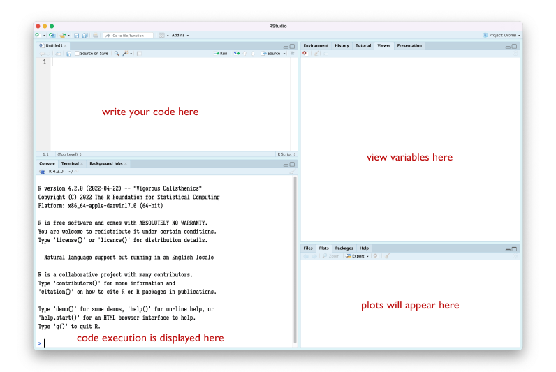

## Setup

- Download and install R from https://cran.rstudio.com/
- Download Rstudio Desktop from https://posit.co/download/rstudio-desktop/


## First steps

1. Start Rstudio




2. Try to plot something:

```
plot(1:10, rnorm(10), xlab="x", ylab="random values")
```

3. Install some packages

```
install.packages('tidyverse')
```

## Resources

- [Hands-on programming with R](https://rstudio-education.github.io/hopr/)
- [R for data science](https://r4ds.had.co.nz/introduction.html)
- [R for data science (2nd edition, in progress)](https://r4ds.hadley.nz/)


## Datasets

Browse through https://github.com/rfordatascience/tidytuesday#datasets


Example:

https://www.kaggle.com/code/willcanniford/chocolate-bar-ratings-extensive-eda/report
[https://www.kaggle.com/datasets/rtatman/chocolate-bar-ratings](dataset)


## Basic steps

```
1 + 1

x = c(1.2, 5.0, 3.4, 4.8)
y = x^2
print(y)

plot(x, y)
```

```
for (i in 1:10) {
  print(paste("file", i, ".png", sep=""))
}
```

```
d = read.csv('data.csv')
```

